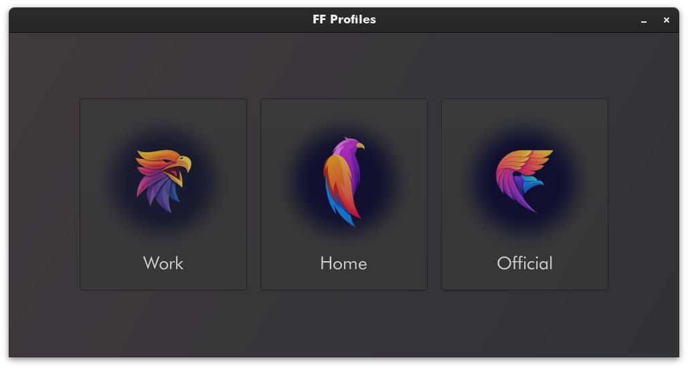

# FF Profiles

Fancy Firefox profile chooser

This allows to open new links in any profile not only the default one

Build

```
gcc $(pkg-config --cflags gtk4) -o build/ff_profiles src/*.c $(pkg-config --libs gtk4)
```

Run

```
./build/ff_profiles https://example.org
```

Setup

```
sudo cp build/ff_profiles /usr/lib/
sudo cp ff_profiles.desktop /usr/share/applications
```

Put profile images to `~/.ff_profiles` without file extentions and with same name as profile


